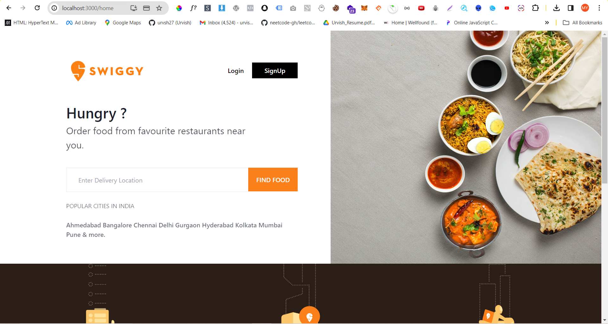
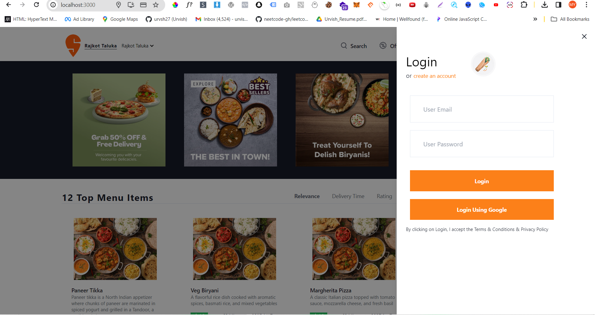
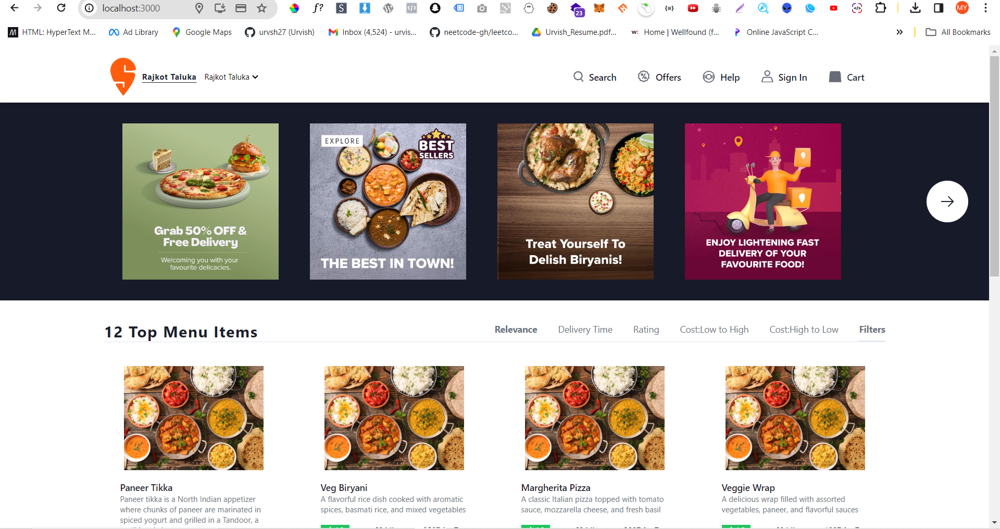
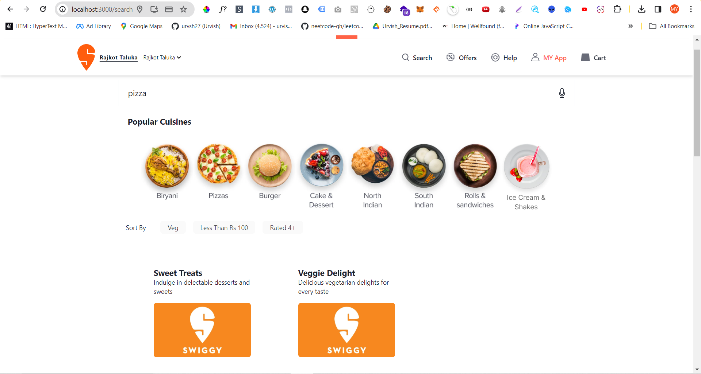
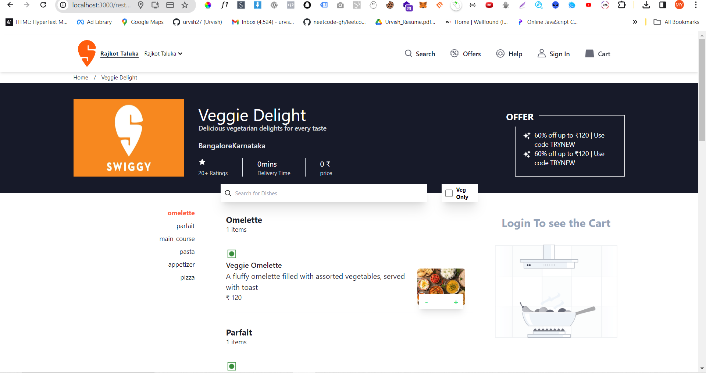
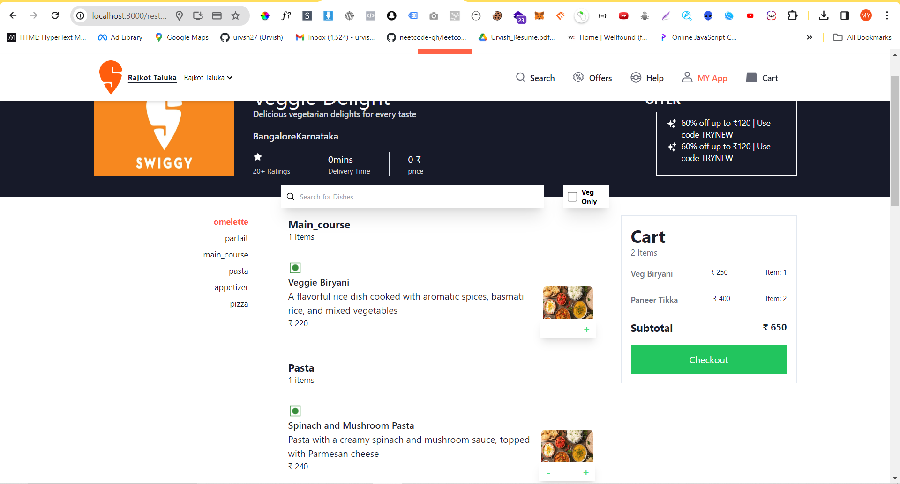
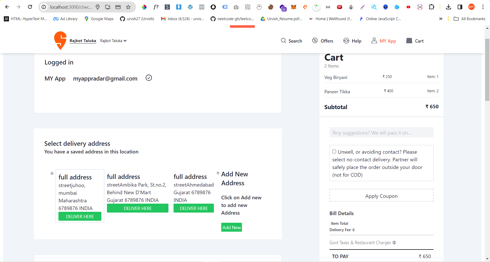
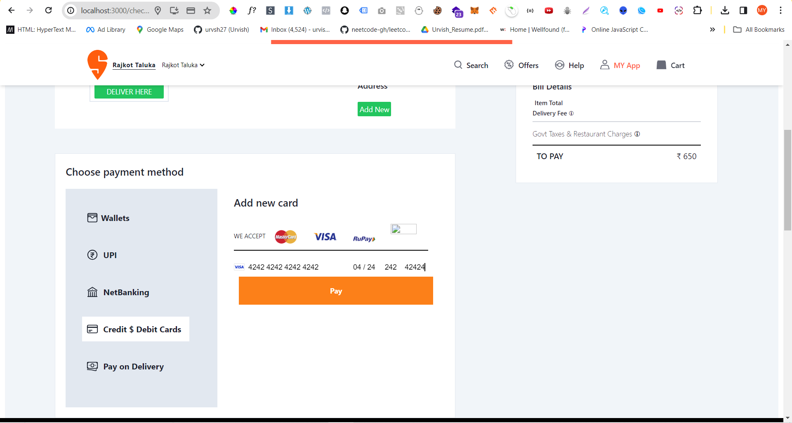
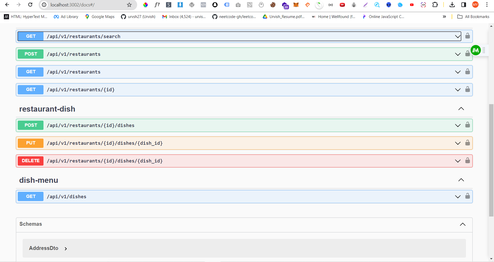

# Swiggy full stack clone

Full stack swiggy clone using next js, nest js, nx mono repo and pnpm workspaces.

## Application services

| app    | port |
| -------- | ------- |
| proxy  |  80    |
| user service | 3001     |
| restaurant service | 3002     |
| cart service | 3003     |
| order service | 3004    |
| payment service | 3005   |
| delivery service | 3006    |
| MQ Listener service | 15672     |

# Screenshots
home

login/ sign up

customer page

search page

restaurant page

cart

checkout 

payment

swagger docs

